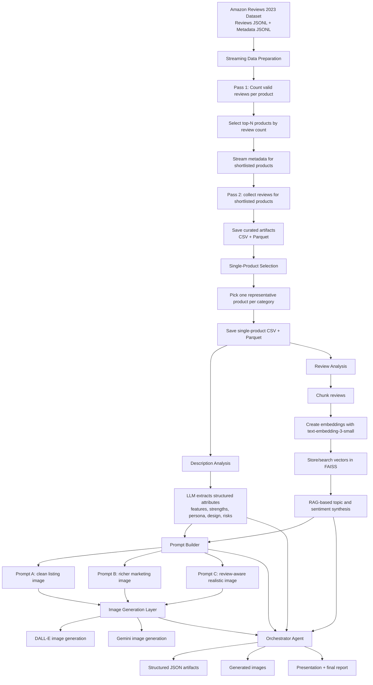

# AI Multimodal Product Intelligence System

An end-to-end GenAI project for turning raw Amazon product metadata and customer reviews into structured product intelligence, retrieval-grounded insights, and multimodal outputs such as prompt-engineered product images.

This repository captures our final project work for a Generative AI lab, including the data-processing pipeline, RAG-based review analysis workflow, agentic orchestration code, generated outputs, presentation materials, and final report.

## At a Glance

- Built a multimodal GenAI pipeline on top of large-scale Amazon Reviews 2023 data
- Combined streaming data engineering, RAG, vector retrieval, prompt engineering, and image generation
- Implemented an agentic workflow that turns raw product data into structured insights and generated visual assets
- Compared multiple model families across text understanding, retrieval, and image generation
- Produced reusable artifacts including cleaned datasets, structured JSON outputs, generated images, and project documentation

## Why This Project Stands Out

This is not just a prompt-engineering demo. It is a full applied AI workflow that combines:

- large-scale unstructured data processing
- grounded LLM reasoning with retrieval
- multimodal generation
- orchestration across multiple AI components
- practical experimentation documented through outputs, presentation material, and a final report

For recruiters and technical reviewers, the project demonstrates applied skills across machine learning systems, LLM application design, data pipelines, experimentation, and end-to-end product thinking.

## Problem Statement

Modern e-commerce products generate large volumes of unstructured information:

- Product metadata and descriptions describe what a seller claims.
- Customer reviews reveal what buyers actually experience.
- Product images shape first impressions, but generating faithful visuals from text alone is difficult.

The core problem we set out to solve was:

**How can we use generative AI to automatically understand products from both descriptions and customer reviews, ground that understanding in evidence, and then use it to generate more realistic product representations?**

We approached this as a multimodal product-understanding system with three goals:

1. Extract structured product knowledge from noisy textual sources.
2. Use retrieval-augmented generation (RAG) to summarize customer sentiment without relying on unsupported LLM guesses.
3. Generate image prompts and compare image outputs from multiple models using both official descriptions and review-informed context.

## What We Built

This project combines data engineering, LLM-based analysis, retrieval, and image generation into a single research pipeline.

### Core capabilities

- Streaming data pipeline for large Amazon Reviews 2023 JSONL files
- Product selection workflow to identify high-signal products per category
- Cleaning and filtering of large review corpora
- Review chunking and embedding generation
- FAISS-based retrieval for grounded review analysis
- LLM-based description understanding and review synthesis
- Prompt generation for product-image creation
- Agentic orchestration layer connecting all stages end to end
- Image generation experiments with DALL-E and Gemini-based image models

### Categories covered

The project analyzes one representative product from each of three distinct product classes:

- `Electronics`
- `Clothing_Shoes_and_Jewelry`
- `Health_and_Household`

These categories were chosen to create variation in geometry, materials, packaging, labeling, and visual complexity.

## Project Highlights

- Built a memory-efficient two-pass streaming pipeline to process large-scale Amazon review files without loading entire datasets into memory.
- Used `text-embedding-3-small` plus FAISS to ground review analysis in retrieved evidence.
- Explored chunking strategies for review corpora, including sentence-level and token-level segmentation.
- Used LLMs to extract structured product attributes such as key features, value propositions, user persona, design cues, and performance dimensions.
- Built an agentic workflow that chains product selection, description analysis, review synthesis, prompt construction, and image generation.
- Generated and stored structured JSON artifacts and multimodal outputs for each category.

## Models and APIs Used

The project combines multiple model families and APIs across different stages of the workflow.

### LLMs

- `GPT-5-mini`
  - Used in the notebook/report workflow for structured description extraction, topic discovery, and RAG-grounded review synthesis.
- `gpt-4o`
  - Used in the scripted agentic workflow for description analysis and review summarization in `agentic_workflow_with_images.py`.

### Embeddings and retrieval

- `text-embedding-3-small`
  - Used to embed review chunks before storing them in a FAISS vector index.
- `FAISS`
  - Used as the vector store for retrieval over embedded review chunks.

### Image generation models

- `DALL-E 3`
  - Used through the OpenAI Images API for prompt-based product image generation.
- `Gemini Flash 2.5 (Nano Banana)`
  - Used in the report experiments as the second image-generation system for comparison.
- Additional Gemini image endpoints appear in the scripted workflow as fallbacks during implementation.

### APIs and platforms

- `OpenAI API`
  - Used for chat completions, embeddings, and image generation.
- `Google Gemini API`
  - Used for Gemini-based image generation.
- `Google AI Studio / Gemini ecosystem`
  - Referenced by the report and implementation for Gemini image-generation workflows.

## End-to-End Architecture



## System Architecture in Plain English

### 1. Data layer

The pipeline begins with the Amazon Reviews 2023 dataset from the UCSD McAuley Lab. For each category, the system uses:

- A reviews JSONL file
- A metadata JSONL file

Because these files are large, the processing code uses a streaming approach instead of loading everything into memory.

### 2. Processing layer

The preprocessing scripts:

- remove empty and ultra-short reviews
- unify product identity using `parent_asin` or `asin`
- count valid reviews per product
- shortlist the most-reviewed products
- join shortlisted products with metadata such as title, price, description, and image availability
- export curated CSV and Parquet artifacts for downstream analysis

### 3. Retrieval and analysis layer

For review understanding, the project builds a retrieval-grounded pipeline:

- reviews are chunked into smaller units
- sentence-level and token-level chunking strategies are compared
- chunks are embedded using OpenAI embeddings
- embeddings are indexed in FAISS
- relevant chunks are retrieved for a query
- an LLM synthesizes themes and sentiment from retrieved evidence

This reduces hallucination risk and keeps summaries tied to the review corpus.

### 4. Agentic orchestration layer

The `agentic_workflow_with_images.py` script organizes the workflow into specialized agents:

- `ProductSelectionAgent`
- `DescriptionAgent`
- `ReviewAgent`
- `PromptBuilderAgent`
- `ImageGenerationAgent`
- `OrchestratorAgent`

Each agent transforms one artifact into another, and the orchestrator manages sequencing, retries, and output serialization.

### 5. Generation and output layer

The system creates:

- structured description summaries
- review-theme summaries
- prompt variants for image generation
- generated images from multiple providers
- machine-readable JSON output files for each category

## Repository Structure

```text
.
|-- Datasets/
|   |-- All Data collected/
|   `-- Filtered & cleaned data/
|-- Model output/
|   |-- Agentic AI Outputs - Bonus Question/
|   |-- Images/
|   `-- ResponseRecord.xlsx
|-- Processing codes/
|   |-- GenAI_lab_final_project.ipynb
|   |-- select_top_products.py
|   |-- shrink_to_single_product.py
|   |-- agentic_workflow_with_images.py
|   `-- view_results.py
|-- Final Report.docx
|-- Final Report (1).pdf
|-- GenAI Lab Final Project Presentation- Group 2.pdf
`-- README.md
```

## Key Files

### Processing code

- `Processing codes/select_top_products.py`
  - Streaming pipeline for selecting top products and collecting associated review data.
- `Processing codes/shrink_to_single_product.py`
  - Reduces each category to a single representative product for deep analysis.
- `Processing codes/agentic_workflow_with_images.py`
  - Agent-based orchestration for structured description analysis, review synthesis, prompt creation, and image generation.
- `Processing codes/GenAI_lab_final_project.ipynb`
  - Notebook containing the broader experimental workflow, including chunking, embeddings, FAISS retrieval, and RAG-based review analysis.

### Output artifacts

- `Datasets/Filtered & cleaned data/`
  - Curated per-category CSV and Parquet files for the final selected products.
- `Model output/Agentic AI Outputs - Bonus Question/`
  - JSON outputs and generated images from the agentic workflow.
- `Model output/Images/`
  - Prompt-based image generation results for category-level comparisons.

## Representative Outputs

From the generated artifacts currently stored in this repo:

- Each category has a structured JSON output file containing:
  - product configuration
  - description analysis
  - review synthesis
  - three prompt variants
  - DALL-E image paths
  - Gemini image paths
- All three categories show successful generation of Prompt A, Prompt B, and Prompt C images for both model families in the saved outputs.
- Review synthesis was capped to sampled subsets for practical token-budget management.
- The report notes that topic extraction was performed from a large sampled subset of reviews because the full corpora exceeded practical token limits.

Examples of selected products include:

- `Electronics`: Panasonic ErgoFit wired earbuds
- `Clothing_Shoes_and_Jewelry`: novelty pullover hoodie
- `Health_and_Household`: cassia essential oil

## Tech Stack

### Languages and libraries

- Python
- Pandas
- FAISS
- OpenAI API
- Google Generative AI / Gemini
- LlamaIndex
- LangChain
- Sentence Transformers
- tiktoken
- python-dotenv

### Model and retrieval components

- `GPT-5-mini` in the notebook/report workflow for structured analysis and RAG-style synthesis
- `gpt-4o` / OpenAI chat usage in the scripted agentic workflow
- `text-embedding-3-small` for embedding review chunks
- `dall-e-3` for image generation
- `Gemini Flash 2.5 (Nano Banana)` for multimodal comparison in the report workflow

### Prompting strategy

The image-generation evaluation used three prompt levels:

- `Prompt A`
  - Minimal product-description prompt for a clean listing-style image.
- `Prompt B`
  - Richer prompt emphasizing materials, textures, and composition.
- `Prompt C`
  - Hybrid prompt that incorporates review-informed customer experience signals.

## How the Workflow Runs

### Stage 1: Product selection and preprocessing

Run the streaming preprocessing script to:

- scan large review files
- count valid reviews per product
- identify top products in each category
- save shortlist metadata and filtered reviews

### Stage 2: Single-product narrowing

Run the single-product reduction script to keep one product per category with sufficient metadata and review coverage.

### Stage 3: Review intelligence and RAG experimentation

Use the notebook to:

- explore chunking strategies
- embed review chunks
- build a FAISS index
- retrieve relevant review evidence
- perform grounded topic and sentiment synthesis
- sample review subsets when full corpora exceed practical model context limits

### Stage 4: Agentic multimodal generation

Run the agentic workflow script to:

- load selected products
- analyze product descriptions
- summarize sampled reviews
- build prompt variants
- call image generation APIs
- save multimodal artifacts

## Setup

### Prerequisites

- Python 3.10+
- API access for OpenAI
- API access for Google AI / Gemini if you want dual-model image generation

### Install dependencies

This repository does not currently include a pinned `requirements.txt`, but the code indicates the need for packages such as:

```bash
pip install pandas openai python-dotenv google-generativeai google-genai faiss-cpu tiktoken llama-index langchain sentence-transformers pyarrow requests scikit-learn nltk torch
```

### Environment variables

Create a `.env` file or export the following:

```bash
OPENAI_API_KEY=your_key_here
GOOGLE_API_KEY=your_key_here
```

### Run order

```bash
python "Processing codes/select_top_products.py"
python "Processing codes/shrink_to_single_product.py"
python "Processing codes/agentic_workflow_with_images.py"
```

## Notes on Reproducibility

- The processing scripts were originally written around local folders such as `out_native/` and `outputs/`.
- This repository stores the final curated artifacts under `Datasets/` and `Model output/`, so paths may need small adjustments when rerunning the pipeline locally.
- The notebook was used for exploration and experimentation, while the Python scripts capture a more operational version of the workflow.
- The report and notebook emphasize `GPT-5-mini` for RAG analysis, while the later scripted workflow currently defaults to `gpt-4o` for text-generation steps.
- Some outputs depend on external APIs and may vary slightly across runs.

## Why This Project Matters

This project is a good example of applied GenAI beyond simple prompt demos. It shows how to combine:

- large-scale data preprocessing
- grounded LLM analysis
- vector retrieval
- multimodal generation
- orchestration logic
- reproducible output artifacts

In practical terms, the system demonstrates how GenAI can help teams:

- understand what customers actually care about
- compare seller claims with buyer experience
- identify strengths, pain points, and market signals
- generate marketing or catalog assets from structured product understanding

## Limitations

- This repository is a research/project artifact, not a deployed production service.
- Dependency management is not yet packaged into a single install manifest.
- Some generated outputs are based on sampled reviews rather than the full review universe.
- Image quality and fidelity vary by provider and prompt style.
- File-path assumptions in scripts may require cleanup for plug-and-play reuse.

## Future Improvements

- Package the project as a reproducible Python application with `requirements.txt` or `pyproject.toml`
- Add evaluation metrics for retrieval quality, summarization quality, and image fidelity
- Add a lightweight UI for product/category selection
- Persist vector indexes and intermediate artifacts more systematically
- Extend to more categories and multi-product comparison dashboards
- Add automated tests and configuration-driven pipelines

## Deliverables Included in This Repo

- Full code used for preprocessing and agentic workflow experiments
- Curated datasets and cleaned intermediate artifacts
- Generated JSON outputs and images
- Final presentation deck
- Final report document and PDF

## License

This repository is licensed under the MIT License. See `LICENSE` for details.
